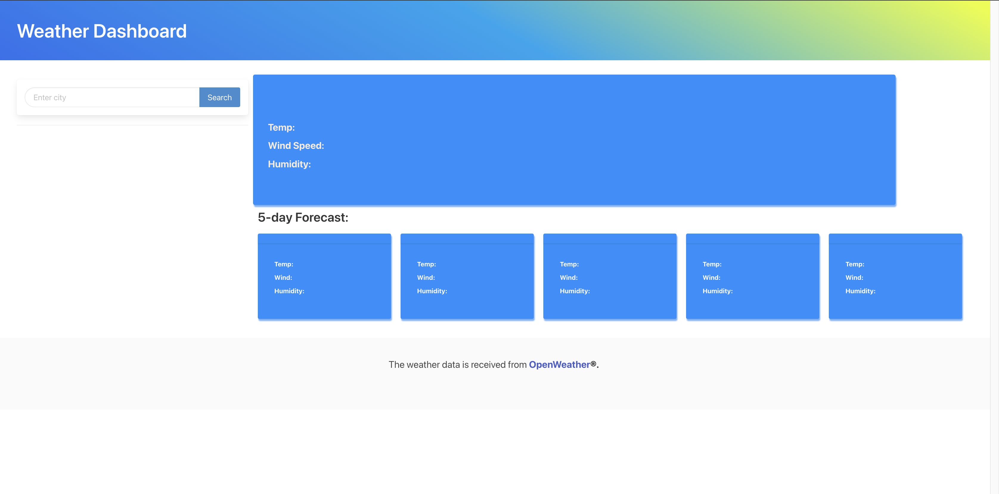
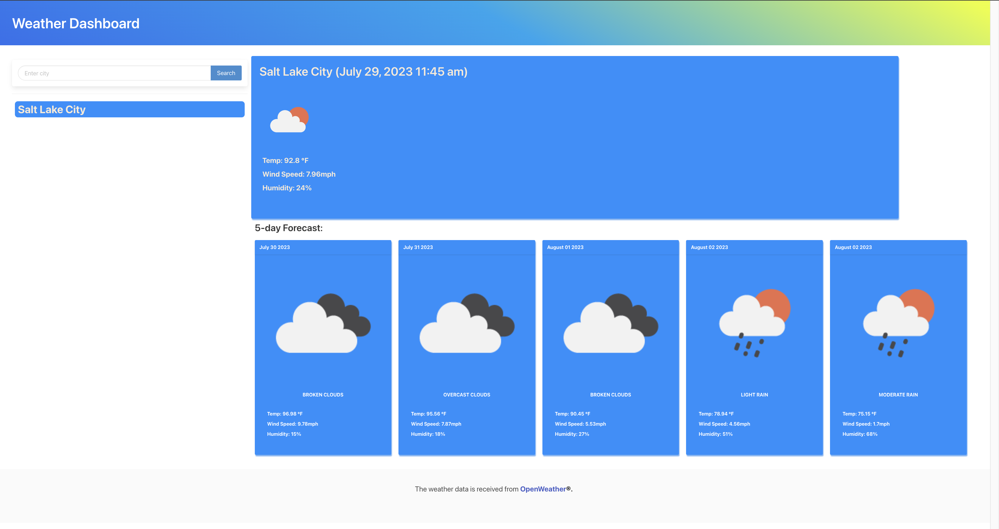
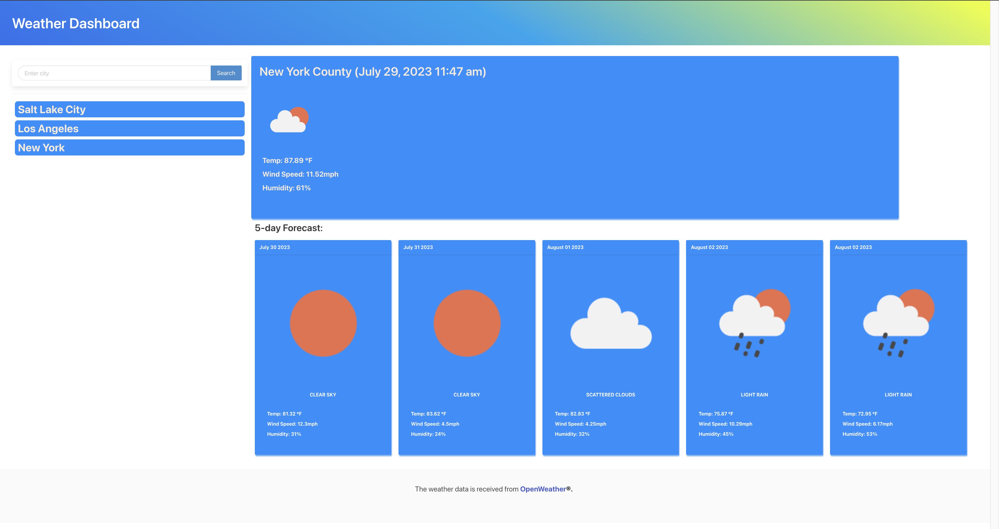

# Weather Dashboard

## Description

This is a webpage to get weather data from the city you search. I used [OpenWeather's](https://openweathermap.org/) API to fetch the weather data onto my page. The page is useful to be able to see the current weather and the 5-day forecast of the specified city. By using the CDN Bulma, I learned a lot about understanding the importance of documentation and how quick and simple it was to create CSS into my project. Using the **fetch()** method in javascript is a great tool to grab data from an api and choose what data you want to create your own project.

## Usage

Live Page: **https://mrpolkadot.github.io/weather-dashboard/**

Enter a city name and the current weather plus a 5-day forecast will return.
   

The searched cities will get saved and you can click on them to show that city's weather again. 

    

## Credits

A huge thanks to the [BULMA](https://bulma.io/) css library. I enjoy using it for this project and has become my favorite CDN to use so far!

Useful links:
* Tutorials on how to use the Bulma CSS library- https://youtube.com/playlist?list=PL4cUxeGkcC9iXItWKbaQxcyDT1u6E7a8a
* CSS Gradient for my colors: https://cssgradient.io/

## License

MIT License

Copyright (c) 2023 Salvador M

Permission is hereby granted, free of charge, to any person obtaining a copy
of this software and associated documentation files (the "Software"), to deal
in the Software without restriction, including without limitation the rights
to use, copy, modify, merge, publish, distribute, sublicense, and/or sell
copies of the Software, and to permit persons to whom the Software is
furnished to do so, subject to the following conditions:

The above copyright notice and this permission notice shall be included in all
copies or substantial portions of the Software.

THE SOFTWARE IS PROVIDED "AS IS", WITHOUT WARRANTY OF ANY KIND, EXPRESS OR
IMPLIED, INCLUDING BUT NOT LIMITED TO THE WARRANTIES OF MERCHANTABILITY,
FITNESS FOR A PARTICULAR PURPOSE AND NONINFRINGEMENT. IN NO EVENT SHALL THE
AUTHORS OR COPYRIGHT HOLDERS BE LIABLE FOR ANY CLAIM, DAMAGES OR OTHER
LIABILITY, WHETHER IN AN ACTION OF CONTRACT, TORT OR OTHERWISE, ARISING FROM,
OUT OF OR IN CONNECTION WITH THE SOFTWARE OR THE USE OR OTHER DEALINGS IN THE
SOFTWARE.

